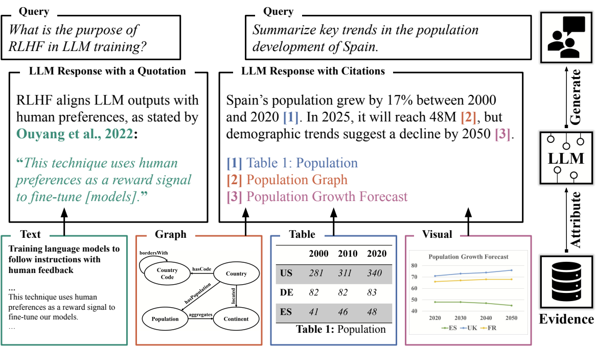
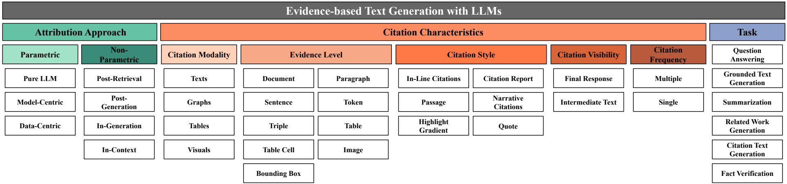
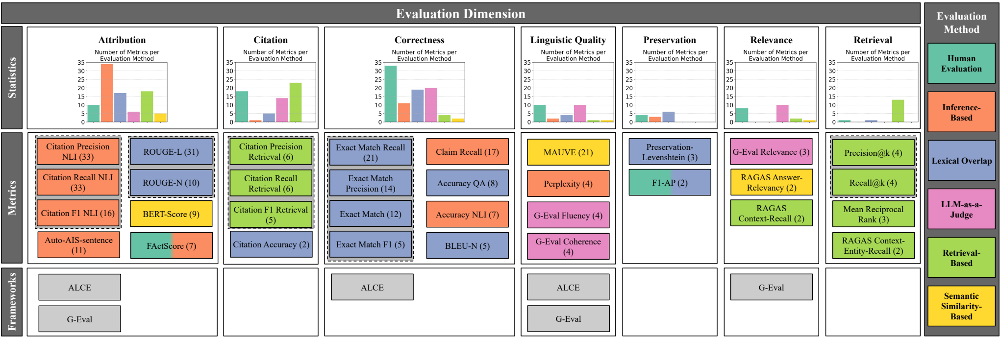

# Attribution, Citation, and Quotation: A Survey of Evidence-based Text Generation with Large Language Models

This repository contains the annotated data for our survey of evidence-based text-generation with LLMs.

## Contents
- [Abstract](#abstract)
- [Methodology](#methodology)
- [Datasets](#datasets)
- [Taxonomy](#taxonomy)
- [Evaluation](#evaluation)
- [License](#license)

## Abstract
The increasing adoption of large language models (LLMs) has raised serious concerns about their reliability and 
trustworthiness. As a result, a growing body of research focuses on evidence-based text generation with LLMs, aiming to 
link model outputs to supporting evidence to ensure traceability and verifiability. However, the field is fragmented 
due to inconsistent terminology, isolated evaluation practices, and a lack of unified benchmarks. To bridge this gap, 
we systematically analyze 134 papers, introduce a unified taxonomy of evidence-based text generation with LLMs, and 
investigate 300 evaluation metrics across seven key dimensions. Thereby, we focus on approaches that use citations, 
attribution, or quotations for evidence-based text generation. Building on this, we examine the distinctive 
characteristics and representative methods in the field. Finally, we highlight open challenges and outline promising 
directions for future work.

***Figure 1.** Illustration of evidence-based text generation with LLMs with various citation modalities and styles.*

## Methodology
We identified targeted keywords to guide the literature search on evidence-based text generation. To stay focused on the 
LLM-based paradigm while covering related concepts, we applied the following search string:

**("large language model" OR "llm") AND ("citation" OR "attribution" OR "quote")**

The search string was matched against the title and abstract of each publication. To ensure comprehensive coverage, we 
queried nine literature databases.

| **Literature Database** | **No. of Papers** |
| ----------------------- | ----------------- |
| ACL Anthology           | 54                |
| ACM Digital Library     | 7                 |
| arXiv                   | 59                |
| ICML Proceedings        | 0                 |
| ICLR Proceedings        | 3                 |
| IEEE Xplore             | 4                 |
| NeurIPS Proceedings     | 3                 |
| ScienceDirect           | 0                 |
| Springer Nature         | 4                 |
| **Total**               | **134**           |

In February 2025, we ran the search and removed duplicates, yielding 805 unique publications. Subsequently, we used the 
following inclusion criteria to identify studies relevant to our research focus: 
- (1) studies that aim to generate natural language text with \acp{llm}, 
- (2) studies that deliberately incorporate references to sources of evidence during text generation, and 
- (3) studies that are written in English with the full texts electronically accessible. 

Publications not meeting all criteria were excluded from the final dataset.
The first two authors independently screened all titles and abstracts, consulting full texts as needed. The inclusion 
decisions were made jointly, resulting in 134 relevant publications.

We categorized each publication by contribution type: approach, application, resource, evaluation, survey, and position:

| **Contribution Type** | **Description**                                                                                                                                                       |
| --------------------- | --------------------------------------------------------------------------------------------------------------------------------------------------------------------- |
| **Approach**          | An approach consists of a set of novel methods, techniques, and procedures that need to be systematically executed to achieve a concrete goal.                        |
| **Application**       | An application is a documented implementation of an existing approach, technique, or method in the form of a software library, prototype, or full application system. |
| **Resource**          | A resource is a published data set that supports approaches, techniques, methods, or applications, e.g., text corpora or benchmarks.                                  |
| **Evaluation**        | Evaluations of existing approaches, techniques, or methods as well as the introduction of new evaluation approaches including, e.g., new metrics or frameworks.       |
| **Survey**            | A survey analyses and synthesizes findings from multiple studies to systematically review a research field or gather evidence on a topic.                             |
| **Position**          | A position paper presents a personal perspective on the suitability or direction of a specific research aspect, without presenting new empirical evidence.            |

All 134 studies were categorized along the defined dimensions, with annotation split between the first two authors. 
Regular reviews refined the scheme and resolved labeling ambiguities. Each paper could be assigned multiple values per 
dimension if needed.

## Datasets
Our annotation results are organized into three datasets: publications.csv, evaluation.csv, and dataset.csv. The latter 
two can be mapped to publications.csv to provide additional information about the datasets and evaluation metrics used 
in each study.

**publications.csv** This dataset contains all publication metadata and the categorization of each paper:

| Column              | Description                                                                                       | Labels                                                                                                                                     |
|---------------------|---------------------------------------------------------------------------------------------------|--------------------------------------------------------------------------------------------------------------------------------------------|
| Title               | Title of the paper                                                                                | /                                                                                                                                          |
| Abstract            | Abstract of the paper                                                                             | /                                                                                                                                          |
| Authors             | Authors of the paper                                                                              | /                                                                                                                                          |
| Date                | The earliest publication date, including preprints                                                | YYYY-MM (e.g. 2024-03)                                                                                                                     |
| Venue               | The conference, journal, or preprint server where the paper was published                         | /                                                                                                                                          |
| Publisher           | The publisher of the conference or journal                                                        | /                                                                                                                                          |
| Url                 | URL to access the paper                                                                           | /                                                                                                                                          |
| Contribution Type   | The type of contribution made by the paper                                                        | approach, application, resource, evaluation, survey, position                                                                              |
| Annotator           | Anonymized annotator who categorized the paper                                                    | A, B                                                                                                                                       |
| Parametric          | Type of parametric attribution approach used                                                      | pure LLM, data-centric, model-centric, no                                                                                                  |
| Non-parametric      | Type of non-parametric attribution approach used                                                  | post-retrieval, post-generation, in-context, in-generation, no                                                                             |
| Citation modality   | Modality of the cited content                                                                     | texts, graphs, tables, visuals, no                                                                                                         |
| Evidence level      | Granularity level of citation                                                                     | document, paragraph, sentence, token, triple, table, table cell, image, bounding box, no                                                   |
| Citation style      | How references to evidence are presented to the user                                              | in-line citation, citation report, passage, narrative citations, highlight gradient, quote, no                                             |
| Citation visibility | Whether citations are visible to the user                                                         | final response, intermediate text, no                                                                                                      |
| Citation frequency  | Number of citations provided per claim                                                            | single, multiple, no                                                                                                                       |
| Task                | Overall task(s) addressed by the paper                                                            | question answering, grounded text generation, summarization, citation text generation, related work generation, fact verification, usw.    |
| Training            | Whether the approach uses training strategies, including pretraining and fine-tuning              | pretraining, supervised fine-tuning, self-supervised fine-tuning, reinforcement learning, no                                               |
| Prompting           | Prompting strategies used by the approach                                                         | zero-shot, few-shot, chain-of-thought, chain-of-citation, chain-of-quote, conflict-aware, active-oriented, role play, self-consistency, no |
| Dataset             | Datasets used by the paper. Can be mapped to datasets.csv using column "dataset"                  | /                                                                                                                                          |
| Benchmark           | Benchmarks used by the paper. Can be mapped to datasets.csv using column "benchmark"              | /                                                                                                                                          |
| Metric              | Evaluation metrics used by the paper. Can be mapped to evaluation.csv using column "metric"       | /                                                                                                                                          |
| Framework           | Evaluation frameworks used by the paper. Can be mapped to evaluation.csv using column "framework" | /                                                                                                                                          |
| Multilinguality     | Does the paper use multilingual data                                                              | yes, no                                                                                                                                    |
| Task name           | Name used in the paper to describe evidence-based text generation                                 | /                                                                                                                                          |
| Citation term       | Term used to describe the concept of integrating evidence                                         | attribution, citation, quote                                                                                                               |

**evaluation.csv** This dataset contains all metrics and frameworks extracted from publications.csv:

| Column               | Description                                                   | Labels                                                                                                         |
| -------------------- |---------------------------------------------------------------|----------------------------------------------------------------------------------------------------------------|
| Metric name          | Abbreviation of the evaluation metric                         | /                                                                                                              |
| Metric abbreviation  | Long name or acronym of the metric                            | /                                                                                                              |
| Framework            | Evaluation framework the metric belongs to                    | /                                                                                                              |
| Evaluation Method    | Evaluation method used by the metric                          | human evaluation, inference-based, lexical overlap, LLM-as-a-judge, retrieval-based, semantic similarity-based |
| Evaluation Dimension | Aspect of the system being evaluated                          | attribution, citation, correctness, linguistic quality, preservation, relevance, retrieval                     |
| Description          | Short description of the metric (from the paper if available) | /                                                                                                              |
| Source               | URL of the paper describing the metric                        | /                                                                                                              |

**datasets.csv** This dataset contains all datasets and benchmarks extracted from publications.csv:

| Column       | Description                                    | Labels |
| ------------ | ---------------------------------------------- |--------|
| Dataset      | Name of the dataset                            | /      |
| Benchmark    | Benchmark the dataset belongs to (if any)      | /      |
| Dataset task | Task(s) the dataset is designed for            | /      |
| Source       | URL to the dataset or the paper introducing it | /      |

## Taxonomy

***Figure 2.** Multidimensional taxonomy of evidence-based text generation with LLMs. The taxonomy categorizes papers 
along three independent dimensions: attribution approach, citation characteristics, and task, which together capture the 
core design choices of evidence-based text generation.*

Figure 2 presents the multidimensional taxonomy we developed to characterize evidence-based text generation with LLMs, 
based on a facetted classification approach. In a facetted design, independent conceptual dimensions describe different 
aspects of the study, enabling flexible representation of complex systems without enforcing artificial mutual 
exclusivity. Such an approach is well suited for evidence-based text generation with LLMs, where methods often combine 
multiple mechanisms and cannot be captured adequately by a single hierarchical structure. Our taxonomy consists of three 
dimensions that together characterize papers on evidence-based text generation with LLMs: (1) attribution approach, (2) 
citation characteristics, and (3) task. These dimensions represent distinct analytical perspectives on system design 
choices. Since real-world approaches frequently combine mechanisms, the taxonomy allows multi-label assignments within a 
dimension, while each dimension captures a separate facet of the system.

**How to classify papers with the multidimensional taxonomy?**
Each study on evidence-based text generation with LLMs is classified across all subdimensions, starting with the 
parametric attribution approaches. A study may be labeled “no” for a given subdimension if it does not apply, for 
example when no parametric attribution approach is used.
The taxonomy is designed to support multi-label classification, allowing a single system to capture multiple approaches 
and by assigning both parametric and non-parametric attribution where applicable. Using the same classification scheme, 
citation characteristics and tasks are annotated accordingly.
The taxonomy can be interpreted as a left-to-right path across all subdimensions, with each path capturing the key 
characteristics of a study on evidence-based text generation with LLMs.

## Evaluation

***Figure 3.** Frequently reused evaluation metrics and frameworks for evidence-based text generation. Numbers in 
parentheses indicate how many studies used each metric. Metrics grouped by dashed lines represent complementary metrics, 
recommended being used together.*

Further we provide an overview of evaluation approaches for evidence-based text generation with LLMs. In total, we 
identified 300 distinct metrics, each targeting different aspects. Figure 3 offers structured overview of frequently 
reused metrics categorized by evaluation method and evaluation dimension. We define reused resources as those employed 
at least twice among surveyed studies.

## License
[License](LICENSE)
